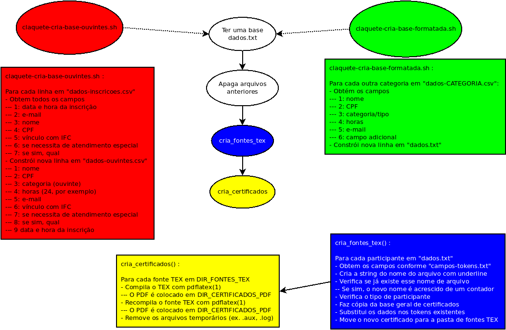

# claquete
Um sistema gerador e distribuidor de certificados de eventos usando scripts BASH

Funcionalidades:
- Gera certificados em lote usando arquivos LaTeX, CSV e BASH
- Permite o envio de certificados em lote via e-mail usando o Mutt
- Consegue criar mais de um certificado para a mesma pessoa em uma mesma categoria de participação

Limitações:
- Não possui código de validação dos PDFs gerados
- Requer conhecimentos em LaTeX e BASH para alterações

Download/Outros:
- Claquete v1.0 - https://drive.google.com/file/d/18ky7x8nVyyhqdckMSj5xqXYP4lfH4zcT/view?usp=sharing
- GitHub: https://github.com/josiney-souza/claquete
- Marca Registrada: Protocolo 926147102
- Vídeo: 

OBS.: O sistema está em processo de registro junto ao INPI.


## Pré-requisitos - programas/aplicativos

Para executar o sistema Claquete, antes é necessário ter:
- Bash
- Uma distribuição LaTeX instalada, por exemplo

```bash
sudo apt install abntex texlive-latex-extra texmaker
```


## Pré-requisitos - arquivos

Para executar o sistema Claquete, antes é necessário ter:

- Um arquivo dados.csv para ser a base de dados dos participantes no evento. Caso não tenha esse arquivo, o sistema Claquete possui um exemplo que pode ser gerado com os seguintes comandos:

```bash
./claquete-cria-base-ouvintes.sh
./claquete-cria-base-formatada.sh
```

O arquivo `dados.csv` criado terá os seguintes campos:

1. Nome
1. CPF
1. Categoria de participação (tipo de participante)
1. Quantidade de horas de participação
1. E-mail
1. Campo adicional (para os mediadores, é usado para indicar o título da atividade que mediou; para os palestrantes, é usado para indicar o título da palestra ministrada; para os organizadores, é usado para descrever as atividades realizadas. Para os ouvintes, não é usado).


## Separadores de campos

- O separador de campos usado nas bases de dados é o `;` (ponto-e-vírgula)
- O separador de campos usado no arquivo [campos-tokens.txt](campos-tokens.txt) é o `;` (ponto-e-vírgula)
- O separador de campos usado no sed(1) é o '#' (cerquilha, hashtag)


## Arquivo [campos-tokens.txt](campos-tokens.txt)

No arquivo [campos-tokens.txt](campos-tokens.txt) está a correspondência entre a variável que deve ser criada no *script* (campo 1); o campo/a coluna que detém os dados específicos de cada usuário na base de dados (campo 2); e o *token* associado aos campos anteriores e que deve ser substituído nos arquivos-fonte .tex para gerar os certificados em PDF.

O conteúdo desse arquivo é:

> NOME;1;NOMEP
>
> CPF;2;CPFP
>
> TIPO;3;TIPOP
>
> HORAS;4;HORASP
>
> EMAIL;5;EMAILP
>
> ADICIONAL;6;ADICIONALP

Ou seja, ele pode ser entendido como:

| Variável do *script* (campo 1) | Coluna na base de dados (campo 2) | *token* correspondente (campo 3)
| --- | --- | --- |
| NOME | 1 | NOMEP |
| CPF | 2 | CPFP |
| TIPO | 3 | TIPOP |
| HORAS | 4 | HORASP |
| EMAIL | 5 | EMAILP |
| ADICIONAL | 6 | ADICIONALP |


## Execução

Para executar, em um terminal, dentro da pasta do sistema, digite:

```bash
./claquete-gera-certificados.sh
```

As ações executadas serão:
1. Apagar os arquivos gerados anteriormente (bases intermediárias, arquivos fonte LaTeX, arquivos PDF)
1. Cria os arquivos fonte LaTeX de todos os participantes (função cria_fontes_tex() )
   1. Carrega, a partir do arquivo [campos-tokens.txt](campos-tokens.txt), a correspondência entre:
      1. as variáveis que devem ser criadas no *script* (campo 1)
      1. o número do campo de leitura na base de dados para obter a informação a ser substituída (campo 2)
      1. o *token* que deverá ser substituído pela informação do campo anterior e que está guardado na variável do primeiro campo (campo 3)
   1. Define o nome do arquivo com base no nome do participante e de sua categoria
   1. Substitui os espaços em branco no nome do arquivo por '_' (*underline*/*underscore*)
   1. Se já houver um certificado com mesmo nome e categoria, adiciona um contador para diferenciar o novo certificado
   1. Faz uma copia da base geral comum TEX
   1. Substitui o texto genérico pelo texto da categoria correta
   1. Altera os *tokens* existentes pelas relações do arquivo [campos-tokens.txt](campos-tokens.txt)
   1. Move o arquivo-fonte TEX para a pasta [fontes-tex](fontes-tex)
1. Cria os arquivos PDF de todos os participantes (função cria_certificados() )
   1. Compila os arquivos-fonte TEX com `pdflatex`
   1. Recompila os arquivos-fonte para resolver símbolos não compilados anteriormente
   1. Disponibiliza os arquivos PDF no diretório [certificados-pdf](certificados-pdf)

Abaixo, uma figura que apresenta os passos executados pelo sistema Claquete:



## Diretórios/pastas

Os seguintes diretórios/pastas fazem parte do sistema Claquete:
- [certificados-pdf](certificados-pdf): para guardar os certificados em PDF finais da execução do sistema. Possui 4 arquivos no repositório, simbolizando um exemplo de cada categoria existente. Se rodar o script, gerarão todos os arquivos das bases;
- [dados](dados): para guardar as bases definitivas (no exemplo, `dados-inscricoes.csv`, `dados-mediadores.csv`, `dados-organizacao.csv`, `dados-palestrantes.csv`) e as bases intermediárias (no exemplo, `dados-ouvintes.csv`, `dados.csv`);
- [fontes-tex](fontes-tex): para guardar os arquivos .TEX que irão gerar os arquivos PDF após compilação. Posui 4 arquivos no repositório, simbolizando um exemplo de cada categoria existente. Se rodar o script, gerarão todos os arquivos das bases;
- [imagens](imagens): para guardar as imagens usadas nos certificados. No exemplo, são 3: a assinatura digitalizada do presidente da comissão organizadora, uma imagem de fundo dos certificados, uma imagem da grade de atividades realizadas no evento;
- [modelos](modelos): para guardar os textos de modelo de cada categoria.


## Tokens

Inicialmente os arquivos .TEX possuem *tokens* que são procurados pelos *scripts* e têm seus valores substituídos por algum dos campos das bases de dados.

Por padrão, são `ALGUMACOISA` e `P` no fim, para indicar que geralmente se trata de uma informação do **P**articipante. Foi escolhido não deixar apenas as palavras sem o `P` final para que o texto literal que deva aparecer no corpo do certificado não seja substituído pelos *scripts*.

Abaixo, os *tokens* usados nos arquivos específicos de cada categoria no exemplo disponibilizado e pelo quê serão substituído:
- NOMEP: campo de "Nome" do participante
- CPFP: campo de "CPF" do participante
- TIPOP: campo de "Categoria" do participante
- HORASP: campo de "Horas" de atividades do participante
- ADICIONALP: campo adicional ("Título" da palestra do participante; "Assunto" do mediador; "Atividades" desenvolvidas pelo organizador). Não é usado para ouvintes.

Abaixo, os *tokens* usados no arquivo de base comum geral dos certificados e pelo quê serão substituídos:
- TEXTOCATEGORIAP: texto específico da categoria
- FUNDOP: endereço da imagem de fundo do certificado
- ASSINATURAP: endereço da imagem de assinatura digitalizada do presidente da comissão organizadora do evento
- GRADEP: endereço da imagem que contém a grade do evento


## Para incluir informações

1. Se for texto simples, estático, alterar o arquivo da base de texto desejada em [modelos](modelos)
1. Se for uma informação diferente para cada participante
   1. Incluir as informações desejadas na base de dados `dados.csv`
   1. Incluir uma nova correspondência no arquivo [campos-tokens.txt](campos-tokens.txt)
   1. Incluir o *token* apropriado no arquivo da base de texto desejada em [modelos](modelos)
1. Executar o *script* [claquete-gera-certificados.sh](claquete-gera-certificados.sh) para gerar os certificados

> :warning: **Aviso:** para os textos funcionarem corretamente, devem estar em uma única linha.


## Para remover informações

1. Se for texto simples, estático, alterar o arquivo da base de texto desejada em [modelos](modelos)
1. Se for uma informação diferente para cada participante
   1. Remover o *token* da informação desejada no arquivo da base de texto alterada em [modelos](modelos)
   1. Remover a correspondência no arquivo [campos-tokens.txt](campos-tokens.txt)
   1. Remover as informações desejadas da base de dados `dados.csv`
1. Executar o *script* [claquete-gera-certificados.sh](claquete-gera-certificados.sh) para atualizar os certificados

> :memo: **OBS.:** Na verdade, remover o *token* já é o suficiente para não propagar as mudanças para os certificados porém, se os demais passos não forem executados, o arquivo de correspondências e a base de dados ficam "poluídos" com "lixo"


## Para incluir categorias

1. Adicionar as informações desejadas no arquivo `dados.csv` conforme padrão das demais bases;
   > :bulb: **Dica:** Use o Microsoft Excel ou LibreOffice Calc para editar a base `dados.csv`
   > 
   > :memo: **Opção:** Alternativamente, você pode criar um arquivo de bases com as informações necessárias (nome, cpf, tipo, horas, adicional) com os campos separados por `;` (ponto-e-vírgula) no diretório/pasta `dados`;
   >
   > Nesse caso, também criar uma nova linha DADOS_NOVACATEGORIA="${DIR_DADOS}/dados-NOVACATEGORIA.csv" no arquivo [variaveis.txt](variaveis.txt);
   >
   > E adicionar `${DADOS_NOVACATEGORIA}` ao comando `for` da linha 30 em `claquete-cria-base-formatada.sh`;
1. Criar uma base de texto para a nova categoria no diretório/pasta [modelos](modelos) - exemplo `base-NOVACATEGORIA.tex`
1. Inserir uma nova linha BASE_NOVACATEGORIA="${DIR_MODELOS}/base-NOVACATEGORIA.tex" no arquivo [variaveis.txt](variaveis.txt);
1. Adicionar novo condicional `elif [[ ${TIPO} == "NOVACATEGORIA" ]]` na cadeia de `if` em `claquete-gera-certificados.sh` (função `cria_fontes_tex()`), como nas linhas 87, 90, 93, 96. Exemplo:

```
elif [[ ${TIPO} == "TIPO_DEFINIDO_NA_BASE" ]]
then
    CONTEUDO=$(cat ${BASE_PALESTRANTE})
```


## Para remover categorias

Basta fazer os passos inversos da inclusão de categorias:
1. Remover o condicional `elif` correspondente;
1. Remover a referência em [variaveis.txt](variaveis.txt);
1. Remover a base de texto correspondente de [modelos](modelos);
1. Remover as informações desejadas de `dados.csv`
> :memo: **OBS.:** Na verdade, remover os dados da base de dados já é o suficiente para não serem processados porém, se os demais passos não forem executados, o sobra "lixo" em arquivos e diretórios/pastas.
